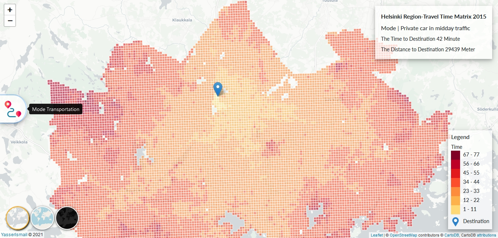
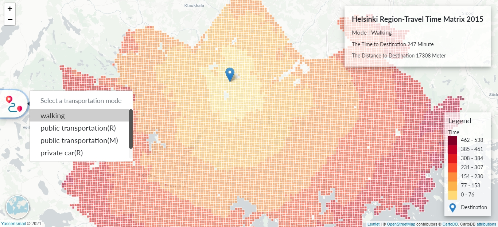
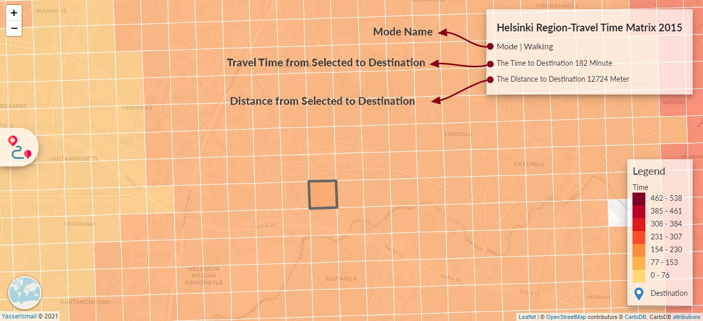

# Helsinki Region Travel Time
A choropleth map is a type of thematic map in which a set of pre-defined areas is colored or patterned in proportion to a statistical variable that represents an aggregate summary of a geographic characteristic within each area, such as population density or per-capita income.
Choropleth maps provide an easy way to visualize how a variable varies across a geographic area or show the level of variability within a region.
#
In this project I did make an interactive choropleth maps for travel time in Helsinki Region. I did use JavaScript and leaflet.js to create it.

#
You can change mode of transportation and map will change based on it,note the map and compare it with the previous map 

#
The box in the top right has data for selected cell

#
